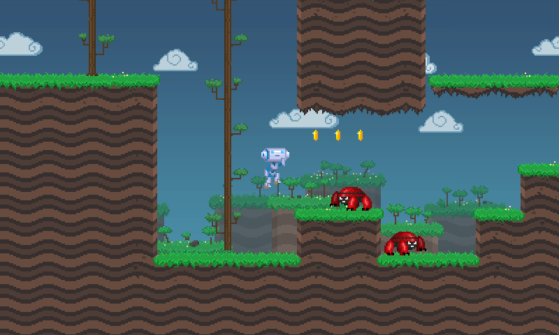
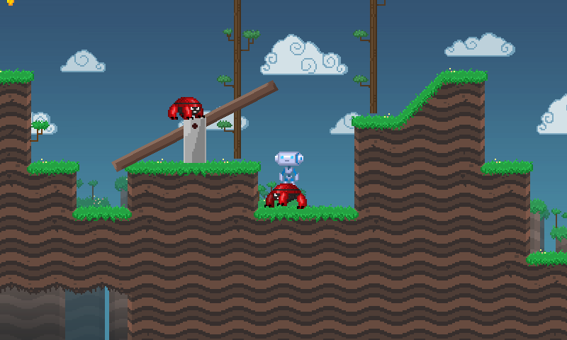

# Jogo 2D

Languagem: GDScript

## Como funciona??

O jogador e os inimigos usam caráter dinâmico
controladores de movimento, feitos com
[`RigidBody2D`](https://docs.godotengine.org/en/latest/classes/class_rigidbody2d.html),
o que significa que eles podem interagir perfeitamente com a física
(há uma gangorra e você pode até montar em inimigos).
Por causa disso, todo movimento deve ser feito em sincronia com
o motor de física, dentro de `_integrate_forces()`.

## Imagens

## Imagens dentro do Aplicativo

 

